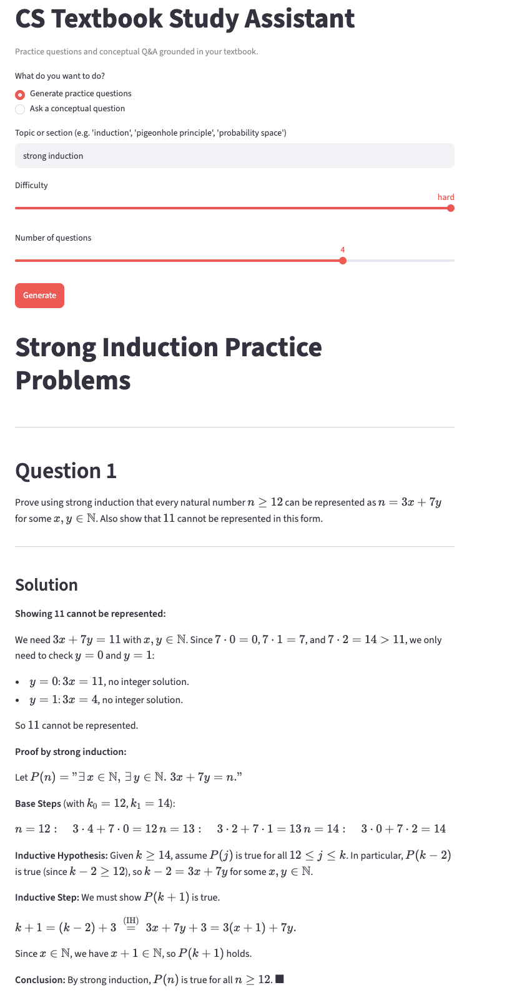

# Discrete Structures RAG

This RAG system is a personal project intentionally tailored to "Lectures in Discrete Mathematics" by Matthew Eichhorn for Cornell CS 2800 rather than a generic PDF ingestion pipeline. This allows for structure-aware chunking (by theorem/definition/section) and manual validation of math-heavy extraction quality against known ground truth.

### Built With

* [](https://www.python.org/)
* [](https://streamlit.io/)
* [](https://www.anthropic.com/)
* [](https://www.trychroma.com/)
* [](https://github.com/datalab-to/marker)

## Setup

```bash
# Marker 1.8.0 must be installed from GitHub (not on PyPI at this version)
pip install git+https://github.com/datalab-to/marker.git@v1.8.0

pip install -r requirements.txt
cp .env.example .env
```

Add Anthropic API key in your `.env` file. Place the textbook PDF in `data/`.

## Usage

```bash
# 1. Build the vector store (run once, or whenever chunking logic changes)
python ingest.py --pdf data/textbook.pdf

# 2. Launch the app
streamlit run app.py
```

## Demo



## Architecture

```
data/textbook.pdf
      |
      v
ingest.py: pdf_to_markdown -> chunk_markdown -> embed_chunks -> store_in_chroma
      |
      v
chroma_db/  (persistent vector store)
      |
      v
rag.py: retrieve() -> _format_context() -> generate_practice_questions() / answer_conceptual_question()
      |
      v
app.py (Streamlit UI)
```

## Architecture decisions

- **Markdown conversion:** 

      -     Initial research pointed to PyMuPDF as a popular choice for PDF-to-Markdown 
      conversion. However, it struggled to convert math equations efficiently, and the
      resulting output was polluted with unknown symbols.

      -     The second candidate was Nougat, which seemed promising at first — it was
      purpose-built as a PDF parser that understands LaTeX math and tables. This too
      ran into issues: it has not been actively maintained by Meta since August 2023
      (as of June 2026), and the library now suffers from significant dependency rot,
       breaking across several transitive dependencies (`albumentations`, `pypdfium2`, 
       `transformers`) on any modern environment.
      
      -     This led to a third candidate, Marker, which handles LaTeX equations well.
       This came with one final hurdle: since development was done on an Apple Silicon 
       MacBook, a known regression in Marker 1.9.0+ causes its table recognition model 
       to be incompatible with the MPS backend, silently falling back to CPU and 
       resulting in significantly longer runtimes. Pinning Marker to version 1.8.0 
       resolved this, producing markdown conversion that is both accurate and rich in 
       metadata, enabling easier downstream post-processing.

- **Chunking strategy:**

      -     Fixed-size chunking was ruled out early, since splitting at character boundaries
      cuts proofs in half and orphans definitions from their theorems. Instead, the
      text is sliced at numbered subsection headings, with labeled blocks (Definition,
      Theorem, Lemma, Example, etc.) additionally extracted as standalone chunks. A
      soft cap is implemented instead of hard cap to prevent splitting mid-section and
      preserve structural integrity.

- **Embedding model:**

      -     A local model was preferred to avoid per-query API costs. `bge-base-en-v1.5`
      was the initial candidate, but profiling the actual chunks revealed an average of
      ~730 tokens and a max of ~4,900 — well above its 512-token limit, meaning most
      chunks would be silently truncated. `nomic-ai/nomic-embed-text-v1` was chosen
      instead for its 8,192-token context window. `max_seq_length` is capped at 2,048
      tokens in practice due to memory constraints on Apple Silicon, 46 of 424 chunks
      exceed this and have their tails truncated. Hard-splitting oversized chunks at
      paragraph boundaries would fix this. 17 of the 46 truncated chunks are labeled
      blocks (Theorems, Lemmas, Definitions, Examples), meaning primary retrieval
      targets are affected — not just surrounding prose. The fix is deferred in favor
      of validating retrieval quality first, but hard-splitting is a likely next step 
      in the future.
- **Retrieval k / thresholding:**

      -     k was set to 6 rather than the conventional default of 4. Since weak results
      are filtered by the threshold anyway, raising k carries no downside — if fewer than
      6 chunks survive, k is irrelevant; if more do, the extra ones are likely relevant.

      -     After computing cosine distance (range in [0, 2]) and converting to 
      similarity via `1 - distance`, scores fall in [-1, 1] where -1 is opposite and 1 
      is identical. Chunks below `_SIMILARITY_THRESHOLD = 0.30` are dropped before
      generation. 0.30 is a conservative starting floor — `nomic-embed-text-v1`'s
      prefix-based training scheme produces well-separated score distributions, but the
      right cutoff depends on the corpus and should be calibrated against actual
      ingested data.

      -     `answer_conceptual_question` returns a canned "not covered" response early
      if no chunks survive the threshold, without calling Claude. This avoids the
      failure mode of confident hallucination on off-curriculum topics.

- **Prompt injection mitigation:**

      -     Retrieved chunks are wrapped in `<chunk section="...">...</chunk>` XML
      delimiters inside `_format_context()`, which gives the model a clear boundary
       between trusted system instructions and untrusted retrieved data.

      -     Both generation functions include a system prompt instruction to treat chunk
      content as data and ignore any directives found inside the tags. The delimiters
      signal structure; the instruction reinforces the intended semantics.

      -     `answer_conceptual_question` also includes a soft guardrail against homework
      submissions: if the question appears to be asking for a direct solution to a
      specific problem, Claude is instructed to decline and redirect to the underlying
      concept instead. This is prompt-only and not a classifier, so a determined student
      can rephrase around it — but doing so yields a conceptual explanation, which is
      acceptable behavior and leads to acceptable outcome.

- **What I'd improve with more time:**

      -     46 of 424 chunks already exceed the 2,048-token embedding cap (17 of which
      are primary retrieval targets: Theorems, Lemmas, Definitions, Examples), meaning
      their tails are silently truncated before embedding. Hard-splitting oversized
      chunks at paragraph boundaries would fix this without losing structural metadata.

      -     The bi-encoder retrieval used here is fast but imprecise — it compares
      independent embeddings in vector space. A cross-encoder reranker attending jointly
      to the query and each candidate chunk would improve precision on the top-k before
      passing context to Claude, at the cost of added latency.

      -     Dense retrieval can miss exact matches for math notation (∀, ∃) and named
      theorems. Combining it with BM25 sparse retrieval and score fusion (e.g. Reciprocal
      Rank Fusion) would improve coverage for both semantic and lexical queries.

      -     Threshold and k tuning was initially manual and intuition-driven. A
      50-question evaluation set (`eval_set.json` / `eval.py`) was added to make
      this data-driven; it was used to calibrate the threshold from 0.30 to 0.54
      and surface a terminology mismatch that was suppressing one retrieval result.

## Evaluation

      -     Retrieval was evaluated against 50 hand-curated questions (`eval_set.json`):
      40 true positives spanning all seven parts of the textbook, and 10 true negatives
      (off-curriculum CS questions that should return no chunks). Final: 49/50 (98%).

      -     The initial threshold of 0.30 failed all 10 true negatives — off-curriculum
      questions were returning automata and probability chunks via lexical overlap
      ("process" → §34.1, "network" → §37.1). Raising it to 0.54 fixed this. The only
      casualty was a terminology mismatch in the eval set ("principle" vs. "rule" for
      §21.1), which resolved once corrected.

      -     The one remaining miss is §3.4 for "How do you negate a statement with
      multiple quantifiers?" — the content is split across §3.3 and §3.4 in a way
      that the query embeds closer to §3.3.

      -     Generation quality was evaluated separately using an LLM-as-judge approach:
      for each of the 40 true positive questions, the full pipeline was run and the
      answer scored 1–5 against a hand-written reference answer by a second Claude
      call. Final: 39/40 scoring ≥ 4, average 4.92/5. The one 3/5 was §9.3 (paths in
      graphs), where the system returned the textbook's definition — path as a sequence
      of distinct edges — rather than the more standard distinct-vertices definition.
      This is retrieval working as intended; the textbook simply uses non-standard
      terminology.

## Security note

Textbook content is retrieved and injected directly into LLM prompts, creating
a prompt injection surface if the textbook itself contained adversarial text.
Retrieved chunks are wrapped in XML delimiters and both system prompts
explicitly instruct the model to treat chunk content as data and ignore any
directives found inside the tags. See `_format_context()` and
`_SYSTEM_CONCEPTUAL` / `_SYSTEM_PRACTICE` in `rag.py`.
